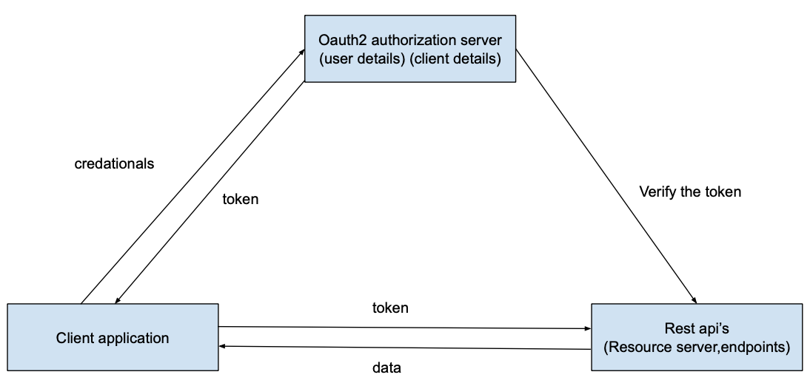
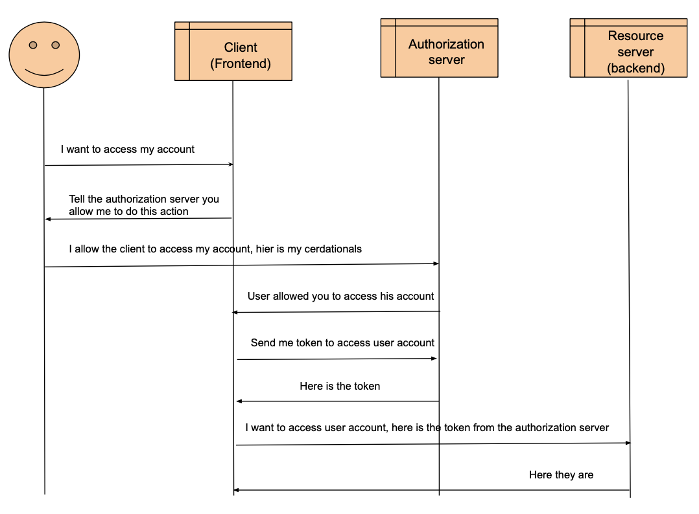
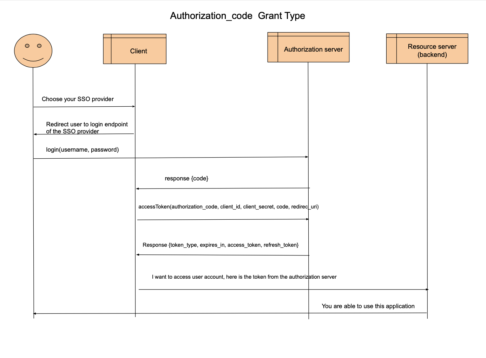
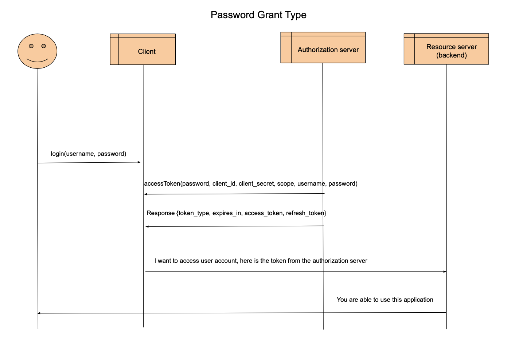
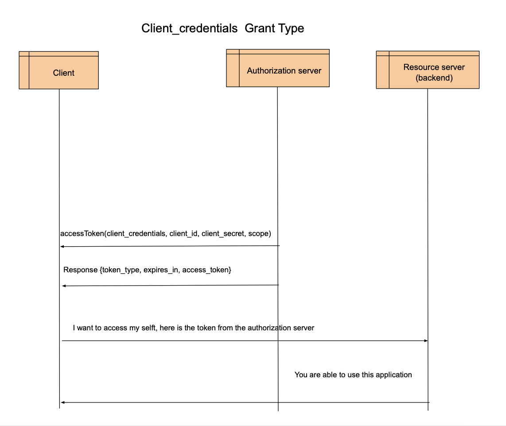

# Oauth2-SSO

The League library can be found here: [OAuth 2.0 Server/LEAGUE](https://oauth2.thephpleague.com)

The framework source code can be found here: [cakephp/cakephp](https://github.com/cakephp/cakephp).



### Create a new CakePHP SSO according to Oauth2 architecture

1. use  composer to download the league library `composer require league/oauth2-server`.
2. Generate a private key and put it in text file.
3. Generate a public key (encryption key), or you can create a file and write what you want.
4. you have to use the previous key files to build the "AuthorizationServerProvider".
5. build de oauth2 database use that database script (mysql) below.
6. you have to build the Entities according to the entities of League library use the entity interfaces of the league library, you can use symfony bundle or laravel passport as example.
7. you have to build the tables with the right columns according to the database.
8. Build the ORM layer according to the Repositories of the League library.
9. You can now build the post token endpoint using the authorization server, you can use symfony bundle or laravel passport as example.
10. You can now build the get authorize endpoint using the authorization server, you can use symfony bundle or laravel passport as example.
11. you can test the endpoints with postman. Attention the type of the body is 'x-ww-form-urlencoded'.
12. you have to build a login/registration endpoints to prove the user and the client, use this example [Symfony SSO example](https://davegebler.com/post/php/build-oauth2-server-php-symfony).

[//]: # ()

## Authorize endpoint


## Token endpoint
The token endpoint has som of grant types, if you want to use one of this grant,
you have to put it in the AuthorizationServerProvider. Then if you create a client in the database you have to save which grants is the client allowed to use.

I have access alle grant types except the implicit grant. I will explain per grant type how this is works.

### Authorization_code grant type
The most important grant type. With this grant can the client get the user data by the code from the authorize endpoint.

#### How does it work?
The client redirect the user the login endpoint, after the user has logged in, the client will get a response with code.
The client will use the token endpoint with authorization_code grant type.
* The client sends a POST request with following body parameters to the authorization server `token(grant_type, client_id, client_secret, code, redirect_uri)`.
The client will exchange the code with access token and refresh token.
* The authorization server will respond with a JSON object containing the following properties `response{token_type, expires_in, access_token, refresh_token}`.
Now can the client send the token to the resource server.



### Password grant type
the client can use this type and get access token and refresh token by username and password.

#### How does it work?
The client can use the token endpoint with the type password as a login endpoint.
* The client sends a POST request with following body parameters to the authorization server `token(grant_type, client_id, client_secret, username, password)`.
* The authorization server will respond with a JSON object containing the following properties `response{token_type, expires_in, access_token, refresh_token}`.
The client will send the access token to th resource server.



### Refresh_token grant type
After that the access token expires the client still have the refresh token. The client can exchange this refresh token with a new access token and refresh token.

#### How does it work?
The client can use token endpoint with the refresh_token grant type.
* The client sends a POST request with following body parameters to the authorization server `token(grant_type, client_id, client_secret, refresh_token)`.
* The authorization server will respond with a JSON object containing the following properties `response{token_type, expires_in, access_token, refresh_token}`.
The client will send the access token to th resource server.


### Client_credentials

This grant is suitable for machine-to-machine authentication, for example would be a client making requests to an API that don’t require user’s permission.

#### How does it work?
The client can use token endpoint with the client_credentials grant type.
* The client sends a POST request with following body parameters to the authorization server `token(grant_type, client_id, client_secret)`.
* The authorization server will respond with a JSON object containing the following properties `response{token_type, expires_in, access_token}`.




### Database structure

I have used the database structure of the basic OAuth2 library and I have adjusted to what I need, according to League database structure. for more information about the database visit [League database setup](https://oauth2.thephpleague.com/database-setup/)

```
create table access_tokens
(
identifier varchar(100)    not null
primary key,
user_id    bigint unsigned null,
client_id  char(36)        not null,
scopes     text            null,
revoked    tinyint(1)      not null,
expires_at datetime        null
)
collate = utf8mb4_unicode_ci;

create index oauth_access_tokens_user_id_index
on access_tokens (user_id);

create table authorization_codes
(
identifier varchar(100)    not null
primary key,
user_id    bigint unsigned not null,
client_id  char(36)        not null,
scopes     text            null,
revoked    tinyint(1)      not null,
expires_at datetime        null
)
collate = utf8mb4_unicode_ci;

create index oauth_auth_codes_user_id_index
on authorization_codes (user_id);

create table clients
(
identifier            char(36)        not null
primary key,
user_id               bigint unsigned null,
name                  varchar(255)    not null,
secret                varchar(100)    null,
redirect              text            not null,
allow_plain_text_pkce tinyint(1)      not null,
grants                varchar(128)    null,
isConfidential        tinyint(1)      null
)
collate = utf8mb4_unicode_ci;

create index oauth_clients_user_id_index
on clients (user_id);

create table refresh_tokens
(
identifier      varchar(100) not null
primary key,
access_token_id varchar(100) not null,
expires_at      datetime     null,
revoked         tinyint(1)   null
)
collate = utf8mb4_unicode_ci;

create index oauth_refresh_tokens_access_token_id_index
on refresh_tokens (access_token_id);

create table scopes
(
identifier varchar(80) not null
primary key,
is_default tinyint(1)  null
);

create table users
(
identifier bigint unsigned auto_increment
primary key,
username   varchar(255) not null,
password   varchar(255) not null,
constraint users_email_unique
unique (username)
)
collate = utf8mb4_unicode_ci;
```
